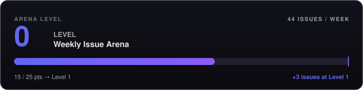
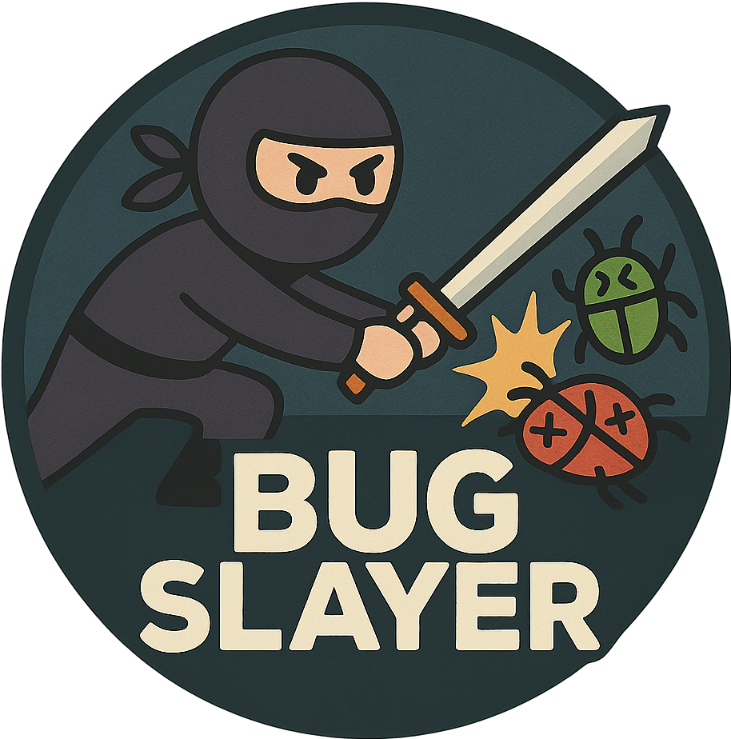

# ⚔️ Weekly Issue Arena

[](https://github.com/claudiotancredi/weekly-issue-arena/actions/workflows/lint.yml)
[](https://github.com/claudiotancredi/weekly-issue-arena/security/code-scanning)
[](https://github.com/claudiotancredi/weekly-issue-arena/stargazers)
[](https://github.com/claudiotancredi/weekly-issue-arena/graphs/contributors)
[](https://github.com/claudiotancredi/weekly-issue-arena/commits/main)
[](https://github.com/claudiotancredi/weekly-issue-arena/blob/main/LICENSE)

> A weekly-refreshed hub of open-source issues, with a leaderboard for contributors who close them.

**Find an issue. Submit a PR. Earn points. Climb the leaderboard.**

Opt in once, with one form. Nothing about you is tracked until you do.

### [🎟️ Join the Arena &rarr;](https://github.com/claudiotancredi/weekly-issue-arena/issues/new?template=join_the_arena.yml)

### [Browse Issues & Leaderboard on the Website &rarr;](https://claudiotancredi.github.io/weekly-issue-arena/)

> **New here?** The homepage matches you with one unclaimed issue in your favorite language in 2 clicks, plus a step-by-step PR walkthrough. [Try it &rarr;](https://claudiotancredi.github.io/weekly-issue-arena/)

<!-- ARENA-LEVEL:START -->
<p align="center">
  <a href="https://claudiotancredi.github.io/weekly-issue-arena/">
    
  </a>
</p>

> **The arena levels up.** Every contribution adds to a shared pool of points. When the pool crosses a threshold, **more issues unlock for everyone**, every week. We're all building this together.
<!-- ARENA-LEVEL:END -->

---

## 🏆 Leaderboard

*Updated hourly. Top 10 all-time contributors.*

<!-- LEADERBOARD:START -->
| Position | Contributor | Points | Rank |
|----------|------------|--------|------|
| — | *No contributions yet — be the first!* | — | — |
<!-- LEADERBOARD:END -->

> In case of a tie, contributors are listed alphabetically by GitHub username.

*[View the full leaderboard on the website &rarr;](https://claudiotancredi.github.io/weekly-issue-arena/leaderboard/)*

---

## 🔥 Merged This Week

*Contributors whose PRs were merged this week, regardless of leaderboard position.*

<!-- MERGED-THIS-WEEK:START -->
*No merged contributions yet this week.*
<!-- MERGED-THIS-WEEK:END -->

---

<details>
<summary> 🙂 Good First Issues (20)</summary>

<!-- ISSUES:GFI:START -->
| # | Title | Repository | Status |
|---|-------|------------|--------|
| 1 | [[Enhancement]Optimize volcano end-to-end scheduling large...](https://github.com/volcano-sh/volcano/issues/3852) | [volcano-sh/volcano](https://github.com/volcano-sh/volcano) | 🟢 Open |
| 2 | [Whisper/Shout plugin API](https://github.com/mumble-voip/mumble/issues/7218) | [mumble-voip/mumble](https://github.com/mumble-voip/mumble) | 🟢 Open |
| 3 | [Refactor Type Checking Imports](https://github.com/collective/icalendar/issues/1707) | [collective/icalendar](https://github.com/collective/icalendar) | 🟢 Open |
| 4 | [Call for User-Contributed Examples and Tutorials!](https://github.com/pyro-ppl/pyro/issues/1461) | [pyro-ppl/pyro](https://github.com/pyro-ppl/pyro) | 🟢 Open |
| 5 | [Parallel Abstracion Layer (PAL) design ](https://github.com/kornia/kornia-rs/issues/538) | [kornia/kornia-rs](https://github.com/kornia/kornia-rs) | 🟢 Open |
| 6 | [registry-creds addon: secrets stored with different name ...](https://github.com/kubernetes/minikube/issues/2805) | [kubernetes/minikube](https://github.com/kubernetes/minikube) | 🟢 Open |
| 7 | [chore(geopandas): Add more edge cases to the `test_match_...](https://github.com/apache/sedona/issues/2392) | [apache/sedona](https://github.com/apache/sedona) | 🟢 Open |
| 8 | [Datamodules that have fixed train/val/test should allow f...](https://github.com/torchgeo/torchgeo/issues/219) | [torchgeo/torchgeo](https://github.com/torchgeo/torchgeo) | 🟢 Open |
| 9 | [Unable to open new tab with ctrl+click on search results](https://github.com/suitenumerique/docs/issues/2603) | [suitenumerique/docs](https://github.com/suitenumerique/docs) | 🟢 Open |
| 10 | [meson build does not install nlohmann_json*.cmake files](https://github.com/nlohmann/json/issues/3885) | [nlohmann/json](https://github.com/nlohmann/json) | 🟢 Open |
| 11 | [Instructions for manual update](https://github.com/RimSort/RimSort/issues/1051) | [RimSort/RimSort](https://github.com/RimSort/RimSort) | 🟢 Open |
| 12 | [In some situations bin/logstash-plugins can fail to run](https://github.com/elastic/logstash/issues/13698) | [elastic/logstash](https://github.com/elastic/logstash) | 🟢 Open |
| 13 | [Client.scheduler_info needs better documentation](https://github.com/dask/distributed/issues/2378) | [dask/distributed](https://github.com/dask/distributed) | 🟢 Open |
| 14 | [[docdb] Expose rocksdb background thread debug info in th...](https://github.com/yugabyte/yugabyte-db/issues/4711) | [yugabyte/yugabyte-db](https://github.com/yugabyte/yugabyte-db) | 🟢 Open |
| 15 | [Automate C# formatting using dotnet-format](https://github.com/dotnet/spark/issues/19) | [dotnet/spark](https://github.com/dotnet/spark) | 🟢 Open |
| 16 | [Memory search - Find pattern very slow](https://github.com/x64dbg/x64dbg/issues/2689) | [x64dbg/x64dbg](https://github.com/x64dbg/x64dbg) | 🟢 Open |
| 17 | [[core] Split raylet  cython file into multiple files](https://github.com/ray-project/ray/issues/51080) | [ray-project/ray](https://github.com/ray-project/ray) | 🟢 Open |
| 18 | [help messages shouldnt exceed 80 columns](https://github.com/radareorg/radare2/issues/23392) | [radareorg/radare2](https://github.com/radareorg/radare2) | 🟢 Open |
| 19 | [Crons: Status Chart X-Axis Makes No Sense for 1H Time Ran...](https://github.com/getsentry/sentry/issues/72139) | [getsentry/sentry](https://github.com/getsentry/sentry) | 🟢 Open |
| 20 | [Add stack trace to warnings](https://github.com/ManimCommunity/manim/issues/4981) | [ManimCommunity/manim](https://github.com/ManimCommunity/manim) | 🟢 Open |
<!-- ISSUES:GFI:END -->

</details>

<details>
<summary> 🪲 Bug Fixes (14)</summary>

<!-- ISSUES:BUGS:START -->
| # | Title | Repository | Status |
|---|-------|------------|--------|
| 1 | [Empty Exception for each open_rasterio call](https://github.com/corteva/rioxarray/issues/929) | [corteva/rioxarray](https://github.com/corteva/rioxarray) | 🟢 Open |
| 2 | [Windows: collection name "." is stored as the collections...](https://github.com/qdrant/qdrant/issues/10418) | [qdrant/qdrant](https://github.com/qdrant/qdrant) | 🟢 Open |
| 3 | [fix(ce): reconcile embedder vector dimensionality (Hashin...](https://github.com/potpie-ai/potpie/issues/909) | [potpie-ai/potpie](https://github.com/potpie-ai/potpie) | 🟢 Open |
| 4 | [[Bug]: Issues with saving settings on new firmware](https://github.com/meshtastic/firmware/issues/11717) | [meshtastic/firmware](https://github.com/meshtastic/firmware) | 🟢 Open |
| 5 | [[Bug] HRMS Web: Hardcoded UI strings bypass translations](https://github.com/frappe/hrms/issues/5113) | [frappe/hrms](https://github.com/frappe/hrms) | 🟢 Open |
| 6 | [Feature Request: Configurable field exclusions for ETag c...](https://github.com/pimutils/vdirsyncer/issues/1214) | [pimutils/vdirsyncer](https://github.com/pimutils/vdirsyncer) | 🟢 Open |
| 7 | [When passing entire resources to a for_each, deprecation ...](https://github.com/opentofu/opentofu/issues/4238) | [opentofu/opentofu](https://github.com/opentofu/opentofu) | 🟢 Open |
| 8 | [Use released model for non-English centric evals](https://github.com/mozilla/translations/issues/1330) | [mozilla/translations](https://github.com/mozilla/translations) | 🟢 Open |
| 9 | [Misc. bug: Inconsistent Vulkan segfault](https://github.com/ggml-org/llama.cpp/issues/10528) | [ggml-org/llama.cpp](https://github.com/ggml-org/llama.cpp) | 🟢 Open |
| 10 | [Blog template displays post excerpt on individual post page](https://github.com/emdash-cms/emdash/issues/2893) | [emdash-cms/emdash](https://github.com/emdash-cms/emdash) | 🟢 Open |
| 11 | [`jl_send_preempt_signal` can allow a Julia thread to exec...](https://github.com/JuliaLang/julia/issues/62863) | [JuliaLang/julia](https://github.com/JuliaLang/julia) | 🟢 Open |
| 12 | [当我pnpm build 的时候 报错 listChapterVersions 未导出](https://github.com/Narcooo/inkos/issues/375) | [Narcooo/inkos](https://github.com/Narcooo/inkos) | 🟢 Open |
| 13 | [`findKotlinMagicFunTest` task causes "No such file or dir...](https://github.com/autonomousapps/dependency-analysis-gradle-plugin/issues/1827) | [autonomousapps/dependency-analysis-gradle-plugin](https://github.com/autonomousapps/dependency-analysis-gradle-plugin) | 🟢 Open |
| 14 | [Status page: Not all sensors displayed](https://github.com/FlexMeasures/flexmeasures/issues/2478) | [FlexMeasures/flexmeasures](https://github.com/FlexMeasures/flexmeasures) | 🟢 Open |
<!-- ISSUES:BUGS:END -->

</details>

<details>
<summary> 😓 Hard Issues (10)</summary>

<!-- ISSUES:HARD:START -->
| # | Title | Repository | Status |
|---|-------|------------|--------|
| 1 | [Unconsistent result when using sum or mean function on Co...](https://github.com/JuliaLang/julia/issues/15523) | [JuliaLang/julia](https://github.com/JuliaLang/julia) | 🟢 Open |
| 2 | [pandas.read_csv() won't read back in complex number dtype...](https://github.com/pandas-dev/pandas/issues/9379) | [pandas-dev/pandas](https://github.com/pandas-dev/pandas) | 🟢 Open |
| 3 | [`isSibling` and `isAncestor` checks](https://github.com/CadQuery/cadquery/issues/1801) | [CadQuery/cadquery](https://github.com/CadQuery/cadquery) | 🟢 Open |
| 4 | [[Doc]: incorporate artist architecture content from matpl...](https://github.com/matplotlib/matplotlib/issues/31597) | [matplotlib/matplotlib](https://github.com/matplotlib/matplotlib) | 🟢 Open |
| 5 | [Document potential traps around Rasterio's multiple envir...](https://github.com/rasterio/rasterio/issues/1270) | [rasterio/rasterio](https://github.com/rasterio/rasterio) | 🟢 Open |
| 6 | [Proposal: Add `cisd` function for argument in degrees](https://github.com/JuliaLang/julia/issues/60445) | [JuliaLang/julia](https://github.com/JuliaLang/julia) | 🟢 Open |
| 7 | [Array API support for CalibratedClassifierCV](https://github.com/scikit-learn/scikit-learn/issues/31869) | [scikit-learn/scikit-learn](https://github.com/scikit-learn/scikit-learn) | 🟢 Open |
| 8 | [matplotlib eventplot not shows all the binary data for bi...](https://github.com/matplotlib/matplotlib/issues/20243) | [matplotlib/matplotlib](https://github.com/matplotlib/matplotlib) | 🟢 Open |
| 9 | [Native categorical splitting enhancements in DecisionTree...](https://github.com/scikit-learn/scikit-learn/issues/33965) | [scikit-learn/scikit-learn](https://github.com/scikit-learn/scikit-learn) | 🟢 Open |
| 10 | [AnimateDiff SparseCtrl RGB does not work as expected](https://github.com/huggingface/diffusers/issues/9508) | [huggingface/diffusers](https://github.com/huggingface/diffusers) | 🟢 Open |
<!-- ISSUES:HARD:END -->

</details>

*[Browse all issues on the website &rarr;](https://claudiotancredi.github.io/weekly-issue-arena/issues/)*

---

<details>
<summary> 💡 How It Works</summary>

Every **Friday at 17:00 UTC**, a GitHub Action automatically rebuilds a fresh pool of ~250 active open-source repositories and pulls new issues from them. Issues are labeled as Good First Issues, Bugs, or Hard Issues. The number of issues pulled per category grows with the [Arena Level](#-arena-level), so collective progress unlocks more weekly issues for everyone.

Every **hour**, another action scans listed issues. If you have joined the arena and you open a PR that references one, that PR is tracked; when it merges, you automatically earn points — feeding both your personal rank and the shared Arena Level. If you also asked for a personal Discussion thread, the arena opens it within ~1 hour of spotting your first PR, and every later status update (merges, points, rank-ups) is posted there as a comment. Level-ups are announced in the [Arena Milestones discussion](https://github.com/claudiotancredi/weekly-issue-arena/discussions/categories/arena-milestones).

Contributions are detected via GitHub's public metadata, but the arena only ever looks at people who asked it to — see [Joining the Arena](#-joining-the-arena).

</details>

<details>
<summary> 🎟️ Joining the Arena</summary>

The arena is **opt-in**. Until you submit the [Join the Arena](https://github.com/claudiotancredi/weekly-issue-arena/issues/new?template=join_the_arena.yml) form, nothing about you enters it: your pull requests are ignored, your username never appears on the leaderboard or in the statistics, and no Discussion ever mentions you.

There is no account and no password. The form **is** the sign-up: a bot reads your answers, stores them in [`.arena_state/preferences.json`](https://github.com/claudiotancredi/weekly-issue-arena/blob/main/.arena_state/preferences.json), and closes the issue right away.

The form asks for two separate permissions:

| Permission | Required | What it means |
|------------|----------|---------------|
| Show my username on the public leaderboard and statistics | Yes | Your username, points and rank become part of the public standings. This is the arena; without it there is nothing to join. |
| Create my personal arena update discussion | No | One Discussion thread, opened when your first qualifying PR is spotted, mentioning you. Every later merge, rank-up and status change is posted there as a comment. Leave it unchecked to earn points with **zero mentions and zero notifications**. |

Nothing happens the moment you join. The arena starts reacting to you the first time you open a pull request that closes an arena issue.

**Changing your mind.** Submit the join form again to update your choices — unchecking the discussion box deletes the thread. To be removed entirely, submit [Leave the Arena](https://github.com/claudiotancredi/weekly-issue-arena/issues/new?template=leave_the_arena.yml): your entry, points, contribution history and Discussion thread are all erased. Your pull requests are untouched either way — they live in the upstream repositories and stay merged.

</details>

<details>
<summary> 📖 Rules & Point System</summary>

- Only contributors who [joined the arena](#-joining-the-arena) are tracked or credited
- You have **7 days** from when an issue is listed (Friday 17:00 UTC) to open a PR
- Issues with a PR are tracked for up to **28 weeks** to allow maintainer review time
- Issues with no PR after 7 days are dropped from tracking
- If your PR closes the issue within the tracking window, you earn points
- Your PR must reference the issue via a closing keyword (`fixes #N`, `closes #N`, `resolves #N`) or be linked through GitHub's sidebar — the automation detects both
- If multiple PRs reference the same issue, **only the one that closes it** earns points
- An issue claimed by a PR shows as 🟡 PR Proposed whether or not its author is in the arena, so nobody duplicates work

| Issue Type         | Points |
|--------------------|--------|
| Good First Issue   | 1 pt   |
| Bug Fix            | 2 pts  |
| Hard Issue         | 4 pts  |

**Status indicators:** 🟢 Open — no PRs yet · 🟡 PR Proposed — an open PR references this issue · 🔴 Closed — resolved or expired

Each point grows your personal rank **and** the shared Arena Level — see the dedicated section below.

**Spread the word:** if you'd like to help the arena grow, feel free to add this at the end of your PR description:

```
I found this issue through [Weekly Issue Arena](https://github.com/claudiotancredi/weekly-issue-arena), a gamified hub that publishes open-source issues weekly.
```

Completely optional — your contribution speaks for itself either way.

| Rank | Badge | Points Required |
|------|-------|----------------|
| Hello World Engineer |  | 0–99 pts |
| Bug Slayer |  | 100–499 pts |
| Mr. Robot |  | 500+ pts |

</details>

<details>
<summary> 🏛️ Arena Level</summary>

Every point earned by every contributor adds to a shared pool. When the pool crosses a threshold, the **arena levels up** and the weekly issue quota grows by **+1 issue per category**. The arena starts at **Level 0** with up to **44 issues** per week and reaches **Level 10** at up to **74 issues** per week. Actual counts may be lower if not enough matching issues are found across the tracked repos.

The current state is shown live on the [home page](https://claudiotancredi.github.io/weekly-issue-arena/) and as the static SVG bar at the top of this README. Level-ups are announced in the [Arena Milestones discussion](https://github.com/claudiotancredi/weekly-issue-arena/discussions/categories/arena-milestones).

| Level | Threshold | GFI | Bug | Hard | Total |
|-------|-----------|-----|-----|------|-------|
| 0     | 0 pts     | 20  | 14  | 10   | **44** |
| 1     | 25 pts    | 21  | 15  | 11   | **47** |
| 2     | 75 pts    | 22  | 16  | 12   | **50** |
| 3     | 150 pts   | 23  | 17  | 13   | **53** |
| 4     | 275 pts   | 24  | 18  | 14   | **56** |
| 5     | 450 pts   | 25  | 19  | 15   | **59** |
| 6     | 700 pts   | 26  | 20  | 16   | **62** |
| 7     | 1050 pts  | 27  | 21  | 17   | **65** |
| 8     | 1500 pts  | 28  | 22  | 18   | **68** |
| 9     | 2100 pts  | 29  | 23  | 19   | **71** |
| 10    | 3000 pts  | 30  | 24  | 20   | **74** |

Thresholds and bonuses live in [config/arena_levels.json](https://github.com/claudiotancredi/weekly-issue-arena/blob/main/config/arena_levels.json).

</details>

<details>
<summary> 🙋 FAQ</summary>

**Q: My PR was merged but I didn't get points.**
First, check that you [joined the arena](#-joining-the-arena) — PRs from people who have not joined are not tracked, and joining does not apply retroactively to a PR that already merged. Second, make sure your PR references the issue — either via a closing keyword (`fixes #N`, `closes #N`, `resolves #N`) in the PR body, or by linking the issue through GitHub's sidebar. The automation detects both. If both are true, open a thread in [Discussions](https://github.com/claudiotancredi/weekly-issue-arena/discussions).

**Q: Can I request a specific repo to be added?**
The pool is rebuilt automatically each week from the GitHub Search API, so any actively maintained repo with `good first issue` or `help wanted` labels is likely to appear on its own. For a guaranteed spot, edit [config/anchor_repos.yml](https://github.com/claudiotancredi/weekly-issue-arena/blob/main/config/anchor_repos.yml) and open a PR.

**Q: What is the Arena Level and how does it grow?**
Every point earned by every contributor adds to a shared pool. When the pool crosses a threshold, the arena levels up and the weekly issue quota grows by one issue per category — so each level unlocks more opportunities for everyone. See the [Arena Level](#-arena-level) section above for the full level table.

**Q: What if I contributed without knowing about the Arena?**
Then nothing happened, by design. The arena does not track, name or notify anyone who has not opted in — it will not turn up in your notifications uninvited. If you like the idea, [join](https://github.com/claudiotancredi/weekly-issue-arena/issues/new?template=join_the_arena.yml) and your next PR will count. Past PRs are not credited retroactively.

**Q: How do I stop the notifications, or leave entirely?**
Every arena Discussion has an **Unsubscribe** button in its sidebar — that alone stops the notifications while keeping your points. To turn the thread off for good, submit the join form again with the discussion box unchecked and the thread is deleted. To remove yourself completely, use [Leave the Arena](https://github.com/claudiotancredi/weekly-issue-arena/issues/new?template=leave_the_arena.yml): your entry, points, history and thread are all erased.

**Q: How is this automated?**
Via GitHub Actions + GitHub REST API. See [`.github/workflows/`](https://github.com/claudiotancredi/weekly-issue-arena/tree/main/.github/workflows) for the full scripts.

</details>

<details>
<summary>🔗 Resources for First-Time Contributors</summary>

- [How to contribute to open source (GitHub Docs)](https://docs.github.com/en/get-started/exploring-projects-on-github/contributing-to-a-project)
- [first-contributions](https://github.com/firstcontributions/first-contributions) — hands-on beginner guide
- [goodfirstissue.dev](https://goodfirstissue.dev) — more issue discovery

</details>

<details>
<summary> 🗂️ Tracked Issue Pool </summary>

The weekly pool of 250 repos is built fresh every Friday by [`scripts/fetch_repos.py`](https://github.com/claudiotancredi/weekly-issue-arena/blob/main/scripts/fetch_repos.py):
- 50 always-included anchor repos: see [`config/anchor_repos.yml`](https://github.com/claudiotancredi/weekly-issue-arena/blob/main/config/anchor_repos.yml)
- ~200 dynamically discovered repos via GitHub Search API (topic-aware queries + trending newcomers)

To suggest a guaranteed-included anchor repo, open a PR editing `config/anchor_repos.yml`. Any other actively maintained repo will likely be picked up automatically.

</details>

<details>
<summary> 🫂 Contributing to the Arena </summary>

- 🎟️ [Join the Arena](https://github.com/claudiotancredi/weekly-issue-arena/issues/new?template=join_the_arena.yml) — opt in so your PRs count
- 💬 [Start a Discussion](https://github.com/claudiotancredi/weekly-issue-arena/discussions) — ideas, questions, edge cases
- 🪲 [File an Issue](https://github.com/claudiotancredi/weekly-issue-arena/issues) — bugs in the automation, feature requests, rule suggestions
- 📦 [Open a PR](https://github.com/claudiotancredi/weekly-issue-arena/pulls) — fix something, add an anchor repo, improve the scripts

</details>

---

## 📜 License

MIT — see [`LICENSE`](https://github.com/claudiotancredi/weekly-issue-arena/blob/main/LICENSE)
